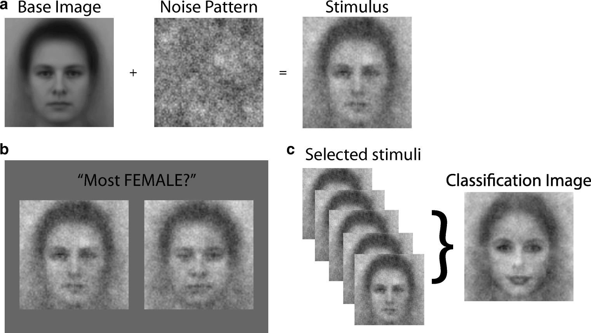
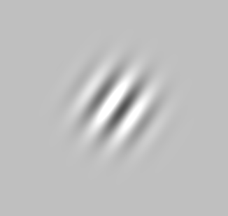
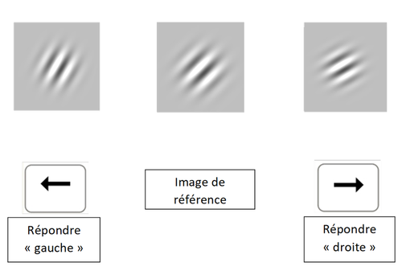
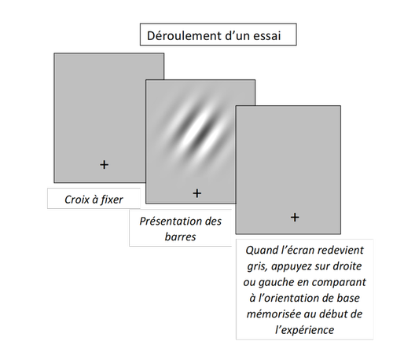
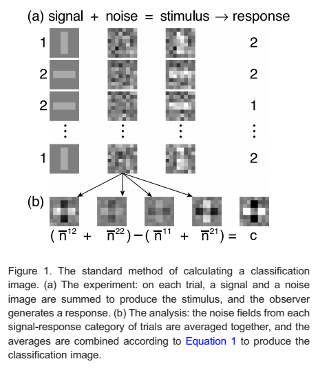
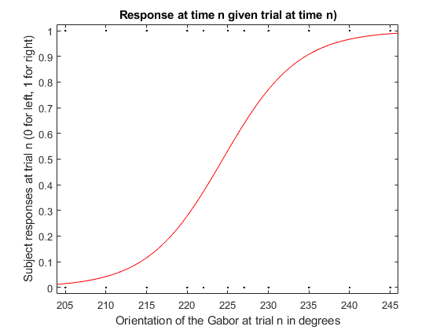
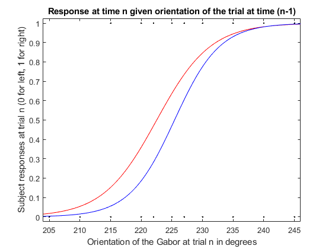
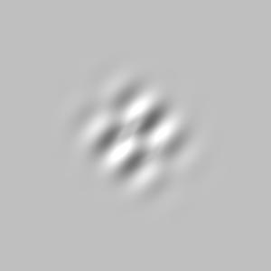

# Rapport de stage

## Le cadre du stage

Ce stage de recherche, qui s'est déroulé de mars à juin 2020, a eu lieu dans le cadre du DENS, sous la tutelle de Thérèse Collins, à l'*INCC* (Integrative Neuroscience and Cognition Center, Université de Paris). La durée de travail était officiellement d'un jour plein par semaine.

Malheureusement, à cause de la situation sanitaire et du confinement qui en a découlé, le stage n'a pas eu lieu au laboratoire, mais s'est déroulé preque entièrement à distance, par courriels ou visioconférences. De même, l'expérience a dû être passée en ligne par les sujets.

## Sommaire

- [Le projet de recherche : dépendance sérielle et image de classification](#projet)
- [Méthode](#methode)
- [Résultats](#resultats)
- [Bilan du stage](#bilan)
- [Bibliographie](#bibliographie)

## Le projet de recherche : dépendance sérielle et image de classification

### La dépendance sérielle

> "*The perception of low-level stimulus features such as orientation and numerosity is systematically biased (i.e., pulled) toward visual input from the recent past. The spatial region over which current orientations are pulled by previous orientations is known as the continuity field, which is temporally tuned for the past 10–15 s*" (Liberman, Fischer & Whitney, 2014)

***

Thérèse Collins, qui était ma tutrice de stage, travaille entre autres sujets sur la "*dépendance sérielle*" dans la perception visuelle. **La dépendance sérielle consiste en l'intégration temporelle d'informations telles que l'orientation ou la numérosité.** Elle est typiquement mise en évidence dans des expériences de jugement d'orientation de barres, où l'on constate que la réponse à l'essai (n) des sujets est influencée par le stimulus vu en (n-1), (n-2), et ce jusqu'à environ 15 secondes dans une zone bien délimitée du champ visuel appelée *"continuity field"*, couvrant environ 15 degrés d'angle visuel (Fischer & Whitney, 2014). Ainsi, ce que l'on a vu récemment influence ce qu'on voit actuellement.

*Résultats tirés de l'article de Fischer et Whitney (2014) sur la dépendance sérielle : l'essai précédent influence l'essai actuel*

Ce phénomène perceptif de bas-niveau, qui ne s'explique pas par des effets de critères de décision, permettrait ainsi de contribuer à la **stabilité perceptive**. Il constituerait un a priori perceptif en faveur d'un monde stable malgré les informations perceptives perpétuellement changeantes (e.g. la luminosité changeant constamment à cause des nuages passant devant le soleil), au même titre que notre système perceptif assure la constance de taille, de couleur ...

### L'image de classification

> "*The central concept of the technique is the correlation of observer decisions with noisy stimulus features over sets of stimuli. From the correlation of the features with the decisions and the inter-correlations among the features, the investigator can then estimate how the observer is weighting the stimulus features to reach a decision.*" (Eckstein & Ahumada, 2002)

***

L'image de classification est une technique comportementale employée en psychophysique. Dans sa forme traditionnelle, elle consiste à ajouter du "*bruit visuel*", c'est-à-dire des pixels distribués aléatoirement, aux stimuli présentés aux sujets. Ces derniers réalisent par exemple une tâche de détection classique, comme dire si le chiffre 3 est présent. Avec suffisamment d'essais, il est possible de faire la moyenne des pixels ajoutés aux stimuli dans l'expérience afin d'en tirer une image de classification. Par exemple, si je fais la moyenne des pixels de tous les essais où le sujet a dit que le chiffre 3 était présent alors qu'il ne l'était pas (fausse alarme), j'obtiendrai ce qui en moyenne a poussé le sujet à répondre de cette manière, et donc l'équivalent du **"*template*" interne** du chiffre 3 du sujet. Cette image peut être rendu encore plus claire si je lui soustrais son opposé, son "*négatif*" photographique (pour filer l'exemple, toutes les fois où le sujet a dit que le chiffre 3 était absent alors qu'il était présent). Cette technique, d'abord cantonnée au champ de la psychophysique, est maintenant employée dans d'autres champs de la psychologie, comme le montre l'image ci-dessous.

*Exemple de l'utilisation de l'image de classification en psychologie sociale (Brinkman et al, 2019)*

L'intérêt de cette technique, et ce qui la rend si intéressante, est **sa nature visuelle et sa dimension exploratoire** : "*Is it the visual nature of the classification image, or is it its exploratory nature that resembles a sort of archeology of perceptual processes » that makes it interesting ?*" (Eckstein & Ahumada, 2002).

### Application de la technique de l'image de classification à la dépendance sérielle

- [x]  Pour passer l'expérience en ligne (ou pour simplement voir les instructions), utiliser ce lien : **tstbl.co/832-291**

La tâche était simple : les sujets mémorisaient un *Gabor patch* dans une certaine orientation au tout début de l'expérience. Ensuite, après un bref entraînement, ils devaient indiquer si le stimulus qui s'affichait devant eux était orienté à droite ou à gauche du Gabor de référence.

L'idée était donc d'**étudier la dépendance sérielle, dans une tâche de jugement d'orientation, via la technique de l'image de classification**. Cela permettrait de savoir ce qui, dans les stimuli précédant le stimulus actuelle, influençait la réponse actuelle du sujet. Autrement dit, de savoir quels aspects du stimulus intervenaient dans la dépendance sérielle.

Cependant, dans notre expérience, aucun bruit visuel n'a été rajouté aux stimuli. Cela se justifiait dans la mesure où nous ne  voulions pas bruiter les données, et où justement nous étions intéressés par les stimuli précédant le stimulus actuel. Dès lors, comment obtenir l'image de classification souhiatée ? En faisant la moyenne des pixels des stimuli vus par le sujet en (n-1) , et ayant influencé sa réponse en (n) via le phénomène de la dépendance sérielle. 

*Résumé de l'adaptation de la technique de l'image de classification à la dépendance sérielle dans notre expérience (aucun bruit n'est ajouté au stimulus*

La démarche était alors doublement exploratoire : non seulement nous ne savions pas quelle image nous allions obtenir, mais de surcroît, **cette image de classification ne correspondait pas à la technique classique**, consistant à faire la moyenne du bruit visuel ajouté aux stimuli présentés pour telle réponse.

## Méthode

### Participants

Les critères d'inclusion étaient d'avoir de 18 à 40 ans, de ne pas avoir de trouble neurologique connu, d'avoir une vision normale ou corrigée et de ne pas prendre de médicaments influençant la vue ou la vigilance. L'échantillonnage était de convenance, dans la mesure où les sujets ont été recrutés par courriel ou sur le réseau social Facebook. L'expérience n'étant pas rémunérée, ils étaient tous volontaires. Au vu des conditions sanitaire et de la fermeture du laboratoire, l'expérience avait lieu en ligne sur la plateforme *Testable.org* (Rezlescu, 2015).

Dix sujets ont passé l'expérience (n = 10), dont 4 garçons et 6 filles d'un âge moyen de 25.2 ans (SD = 2.6). 

### Stimuli

Les *Gabor patchs* ont été créés sur Matlab grâce à la fonction "*CreateProceduralGabor*" de *Psychtoolbox* (Kleiner, Brainard & Peli, 2007). Ils avaient une fréquence spatiale de 0.03 cycles par pixel (?) et un écart-type de 32° (?). /à confirmer/

*Exemple de Gabor utilisé dans l'expérience*

### Procédure

Au début de l'expérience, les sujets étaient amenés à mémoriser un Gabor patch dans une orientation de référence (225°), qui leur servirait d'ancre durant toute l'expérience, pour dire si les stimuli présentés étaient à droite ou à gauche de cette ancre.

A chaque essai, une croix de fixation était présentée durant 1 seconde, suivie d'un Gabor patch dans une orientation randomisée entre 200° et 250 pendant 500ms. Le sujet comparait alors cette orientation à l'orientation de référence grâce aux flèches droite et gauche du clavier.

Chaque sujet avait 14 essais d'entraînement au début de l'expérience, dont 8 avec un feedback de succès ou d'échec pour être certain qu'ils avaient bien compris la tâche et mémorisé l'orientation de référence. L'expérience comportait en tout 390 essais par sujet, soit 30 présentation des 13 orientations choisies entre 200° et 250°. L'ordre des présentations était aléatoire, et les sujets avaient le droit de prendre une pause au milieu de l'expérience.

### Calcul de l'image de classification

L'image de classification était obtenue en relevant toutes les orientations en (n-1) - soit les orientations des Gabors vus il y a environ 2 secondes par le sujet - pour toutes les réponses "Gauche" à l'essai (n), de même que pour toutes les réponses "Droite" à l'essai (n). Cela nous donnait deux listes (les orientations des Gabors en n-1 pour les réponses gauches, de même pour les réponses droites). A partir de ces deux vecteurs, on pouvait obtenir deux images en calculant la moyenne, pixel par pixel, des Gabors contenus dans chaque vecteur. L'image de classification était alors calculée en soustrayant l'image moyenne gauche à l'image moyenne droite (et inversement), afin d'obtenir une image encore plus définie, dans la mesure où ces deux images sont censées êtres en quelque sorte les "*négatifs*" l'une de l'autre.

*Méthode standard pour calculer une image de classification (Murray, 2011)*

Ainsi, **nous adaptions la technique de l'image de classification en remplaçant le bruit visuel par les orientations vues en (n-1)**; le phénomène de dépendance sériel était donc ici la source de "*bruit*" qui influençait les réponses du sujet.

## Resultats

### Sanity check

Afin de s'assurer que la tâche était correctement effectuée par les sujets, il fallait modéliser leurs réponses en fonction de l'orientation à l'essai (n) grâce à une fonction logistique sigmoïde.

*Modélisation de la réponse des sujets en fonction de l'orientation à l'essai (n) sous Matlab*

Le seuil moyen (i.e. l'orientation pour laquelle il y avait 50% de réponses "gauche", et 50% de réponses "droite") était de 224.4°, ce qui est relativement proche du seuil objectif de 225° (orientation de référence).

On voit donc ici que **les sujets réalisent bien en moyenne la tâche de discrimination demandée**.

### Mise en évidence de la dépendance sérielle

Pour vérifier la présence de la dépendance sérielle, il est possible de modéliser cette même fonction sigmoïde pour chaque sujet, mais en séparant les réponses pour lesquelles l'orientation en (n-1) était à gauche de l'orientation de base des réponses pour lesquelles l'orientation en (n-1) était à droite.

On obtient ainsi la même figure, mais avec deux courbes bien distinctes, comme le montre l'exemple suivant (tiré des résultats d'un sujet) :

*Courbe rouge : essai en (n-1) à droite; courbe bleue : essai en (n-1) à gauche de l'orientation de référence*

On note ici que **le seuil n'est pas le même en fonction de l'orientation en (n-1)** : quand l'essai en (n-1) est à droite, le seuil se décale vers la gauche (ici : 222.5), et le sujet va ainsi avoir tendance à considérer que l'orientation en (n) est à droite alors qu'elle est, par exemple, très légèrement à gauche de l'ancre de référence. Et inversement pour les essais en (n-1) à gauche.

Pour autant, si les résultats de ce sujet-ci sont particulièrement marqués, il faut noter que l'effet est parfois plus léger - si ce n'est inexistant - pour certains sujets, voire inverse aux résultats attendus. Ainsi, faire la moyenne des résultats sur tous les sujets risquerait de neutraliser les effets de dépendance sérielle à cause de cette variabilité inter-sujets.

### L'image de classification et son interprétation

#### Exemple d'images de classification obtenue

Voici un exemple d'images de classification obtenues :

*Image de classification pour les orientations vues en (n-1) avec une réponse gauche en (n)*

*Image de classification pour les orientations vues en (n-1) avec une réponse droite en (n)*

Le problème majeur qui se pose reste **l'interprétation de ces images de classification**, qui, rappelons-le, n'ont pas été obtenues de la façon habituelle. Il s'agit ici de la différence des moyennes des matrices de pixels de Gabors dans différentes orientations.

#### Corrélation avec les images "contrôles" calculées à partir de l'orientation du Gabor à l'essai (n)

Il est tout d'abord possible de calculer la corrélation de ces images de classification avec l'image de classification "contrôle" obtenue en prenant en compte non pas l'orientation du Gabor à l'essai (n-1), mais à l'essai (n). Cette image de classification contrôle reflète ce qui à l'essai actuel a influencé la réponse du sujet, et donc tout simplement, est une image du stimulus "*moyen*" qui a poussé le sujet à répondre gauche ou droite. 

*Exemple d'image de classification "contrôle" pour les orientations vues en (n) avec une réponse gauche en (n)*

On remarque que l'image de classification "contrôle" est plus marquée et plus nette que l'image de classification prenant en compte les essais vus en (n-1); cela est attendu dans la mesure où l'effet du stimulus actuel est bien plus pregnant que le phénomène de dépendance sérielle.

Ainsi, calculer cette corrélation permet de vérifier par exemple que l'image de classification calculée à partir des Gabors à l'essai (n-1) pour les réponses gauches est positivement corrèlée avec l'image contrôle des Gabors à l'essai (n) pour les réponses gauches, et négativement pour l'image calculée à partir des Gabors à l'essai (n) pour les réponses droites. On s'attend donc à une corrélation positive pour les images calculées en (n) et en (n-1) pour les mêmes réponses en (n), et négative pour des réponses différentes en (n). C'est en effet le résultat qu'on obtient en faisant la corrélation des images de classification grâce à la fonction "*corr2*" de l'"*Image Processing Toolbox* de Matlab qui permet de calculer la corrélation entre deux images 2D :

- une corrélation positive moyenne de **r = 0.17** pour les images de classification portant sur les mêmes réponses
- une corrélation négative moyenne de **r = -0.17** pour les images de classification portant sur des réponses différentes

Le fait que ces corrélations soient relativement faibles s'explique par le fait que les images de classification obtenues à partir des orientations en (n-1) sont plus "*bruitées*" que les images de classification contrôle, dans la mesure où elles dépendent uniquement du phénomène de dépendance sérielle.

#### (Analyse spectrale et analyse de la variabilité)/## Discussion

## Bilan du stage

### Expertise théorique

Avant de commencer ce stage, je ne connaissais pas le phénomène de la dépendance sérielle, remis au goût du jour par l'article de Fischer & Whitney (2014). Il est toujours intéressant de découvrir des phénomènes perceptifs aussi basiques, notamment parce que ceux-ci peuvent jouer un rôle dans la plupart des expériences de psychologie, sans que les expérimentateurs s'en rendent compte.

Je connaissais la technique de l'image de classification, pour l'avoir étudiée en cours de méthodologie à l'ENS et pour avoir lu quelques articles l'utilisant. Mais, pour autant, je n'en comprenais pas la méthode de calcul, et n'avais pas réalisé à quel point cette technique peut être employé dans tous les champs de la psychologie, notamment en psychologie sociale.

Enfin, ce stage m'a permis de revoir quelques concepts que je ne maîtrisais pas forcément, comme par exemple l'utilisation de la fonction logistique sigmoïde pour modéliser la fonction psychométrique.

### Statistiques et exploitation des données

Le traitement des données a été pour moi la partie la plus difficile du stage, celle dans laquelle j'ai eu l'impression d'avoir le moins de choses à apporter. En effet, je ne suis pas encore très avancé en statistiques, dans la mesure où je n'ai suivi que les cours de L1 et de L2, et que de surcroît la majeure partie du traitement statistique consistait à analyser une image, ce que je n'avais jamais fait. J'ai donc conscience qu'il me faudra combler cette lacune, notamment en prenant en main des logiciels tels que R et en m'habituant à manipuler les données de façon efficace.

### Programmation

J'avais déjà une expérience en programmation, dans la mesure où j'avais suivi un cours d'introduction à la programmation à l'ENS, et le cours de programmation en sciences cognitives du Cogmaster. De fait, je n'ai pas l'impression d'avoir rencontré de difficultés majeures dans la création de l'expérience, qui restait relativement simple, de même que le calcul de l'image de classification.

Pour autant, ce stage m'a permis de découvrir le langage Matlab, que j'ai pu commencer à apprendre notamment grâce au livre de Fitzpatrick & Ledeczi (2014) intitulé "*Computer Programming with Matlab*". De même, j'ai dû me familiariser avec le module "*Psychtoolbox"* (Kleiner, Brainard & Peli, 2007) pour programmer l'expérience au départ, lorsque la passation était encore censée se dérouler au laboratoire.

Enfin, à cause du confinement, il a fallu reprogrammer l'expérience afin de la mettre en ligne sur la plateforme "*testable.org*" (Rezlescu, 2015), dont la prise en main est assez intuitive : il s'agit de coder l'expérience grâce à un fichier *.csv* où la plupart des fonctions utiles sont déjà précodées (e.g. la croix de fixation, l'enregistrement des temps de réactions, etc.).

### Esprit scientifique

Par ailleurs, ce stage m'a permis de développer mon esprit scientifique. Tout d'abord, j'ai pu découvrir ou réemployer des outils très utiles pour se rapproche de l'"*open science*", comme le site "*testable.org*" (Rezlescu, 2015) qui permet de faire passer des expérience en ligne, ou la plateforme Github qui permet de partager par exemple le code que l'on a employé pour programmer l'expérience ou encore les données recueillies auprès des participants.

Ensuite, j'ai pu saisir la mesure de l'importance de la collaboration, avec une chercheuse expérimentée qui pouvait répondre à toutes mes questions, et qui n'hésitait pas à me partager ses questionnements, le cheminement de sa pensée ... Cela pouvait parfois s'avérer risqué, dans la mesure où cela a pu créer chez moi une forme de passivité, émanant sans doute aussi de la situation de confinement. Je pense qu'*in fine* j'aurais pu poser plus de question à ma tutrice et surtout essayer de proposer plus d'idées pour l'expérience.

Enfin, ce stage m'a fait réfléchir au fameux *biais de confirmation d'hypothèse* (Nickerson, 1998), dont il est très difficile de se prémunir dans la recherche, lorsqu'on s'attend à trouver tel ou tel résultat. Il m'a ainsi été difficile d'admettre que la dépendance sérielle n'était pas retrouvée chez tous les sujets.

## Bibliographie

- Brinkman, L., Goffin, S., van de Schoot, R., van Haren, N. E., Dotsch, R., & Aarts, H. (2019). Quantifying the informational value of classification images. Behavior research methods, 51(5), 2059-2073.
- Eckstein, M. P., & Ahumada, A. J. (2002). Classification images: A tool to analyze visual strategies. Journal of Vision, 2(1), i-i.
- Fischer, J., & Whitney, D. (2014). Serial dependence in visual perception. Nature neuroscience, 17(5), 738-743.
- Fitzpatrick, J. M., & Ledeczi, A. (2015). Computer Programming with MATLAB. J. Michael Fitzpatrick Ákos Lédeczi.
- Kleiner, M., Brainard, D., & Pelli, D. (2007). What's new in Psychtoolbox-3?.
- Liberman, A., Fischer, J., & Whitney, D. (2014). Serial dependence in the perception of faces. Current biology, 24(21), 2569-2574.
- Murray, R. F. (2011). Classification images: A review. Journal of vision, 11(5), 2-2.
- Nickerson, R. S. (1998). Confirmation bias: A ubiquitous phenomenon in many guises. Review of general psychology, 2(2), 175-220.
- Rezlescu, C. (2015). TESTABLE-The web-based platform for creating, running and sharing behavioural experiments. In Association for Psychological Science Teaching Institute Conference, New York, 21--24 May.
